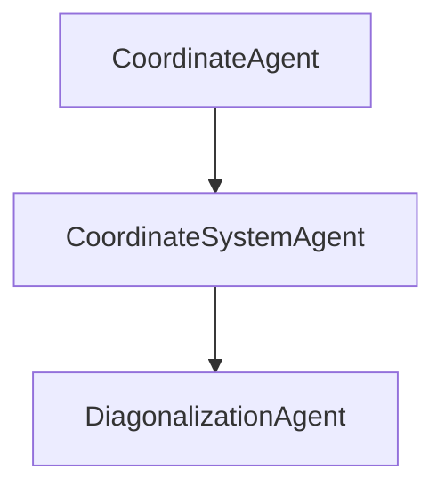

# **AGENTS.md**

## **Purpose**

Defines all conceptual and functional agents in the **Codex** framework — autonomous entities that collectively realize the scalable, operator-aware PDE method.
Each agent encapsulates a distinct role (geometry, physics, algebra, or integration) and interacts through symbolic or functional interfaces.

---

## **I. CONCEPTUAL OVERVIEW**

### 1. Mirrors of Functionality

Think of the framework as a **hall of mirrors** centered on the abstract contract `CoordinateSystem`:

| Mirror                     | Layer / Module               | Core Purpose                                                                 |
| -------------------------- | ---------------------------- | --------------------------------------------------------------------------- |
| **Numeric**                | `pspace.core`                | Baseline coordinate system: geometry, basis construction, quadrature, sparsity, reconstruction. |
| **Sparsity Mirror**        | `pspace.sparsity`            | Decorator that enforces sparse/dense behavior on any coordinate-system instance.      |
| **Symbolic**               | `pspace.symbolic`            | SymPy mirror for exact projections/reconstructions.                         |
| **Analytic**               | `pspace.analytic`            | Closed-form Hermite/Legendre/Laguerre integration mirror.                   |
| **Profiling**              | `pspace.profile`             | Timing-decorated mirror; powers CLI timing scripts with summaries/speedups. |
| **Validation / Diagnostics**| `pspace.validate`, `pspace.verify`, `pspace.diagnostic` | Persist residuals, conditioning, cross-checks.            |
| **Parallel / Distributed** | `pspace.parallel`            | Decorator that dispatches vector/matrix work according to a parallel policy (basis- or coordinate-partitioned, etc.). |
| **Optimization / Control***| `pspace.optimize`            | Map contract into adjoints/gradient tracking.                               |
| **Data / I/O***            | `pspace.export`              | Serialize operations/metadata.                                              |
| **Surrogate / ML***        | `pspace.learn`               | Serve trained surrogates behind the same interface.                         |

`*` denotes future expansion slots. Numeric, symbolic, analytic, and profiling mirrors exist today; sparsity is being teased apart, and parallelism is the next planned basis vector so contexts can be composed (“numeric + sparsity + profiling”, “analytic + parallel”, etc.) against the constant `CoordinateSystem` contract.

Think of each mirror/trait as a basis vector in an aspect-oriented space: we mix and match the vectors we need, all while the immutable `CoordinateSystem` contract anchors the composition. The Decorator pattern gives the mechanics, the aspect mindset keeps cross-cutting concerns orthogonal, and a future “context composer” will assemble the right combination for each use case.

### 2. High-Dimensional Dualities

Beyond “basis vs coefficients,” the system mirrors several dual spaces:

* Primal ↔ Adjoint
* Physical ↔ Computational ↔ Probabilistic coordinates (y, z, ξ)
* Tensor ↔ Sparse ↔ Low-rank representations
* Operator ↔ Data duals (Gram vs samples)
* Time ↔ Frequency domains (FFT-based periodic coordinates)

Each interface has a dual that traverses an alternative representation seamlessly.
Keeping the abstract contract consistent allows new mirrors without breaking geometric symmetry.

class InnerProduct(ABC):
    """Abstract ⟨x, y⟩ contract."""
    @abstractmethod
    def compute(self, x: np.ndarray, y: np.ndarray) -> float:
        ...

Note in the following example code, NumpyInnerProduct, MPIInnerProduct, ProfileInnerProduct are reflections on a particular aspect that we want to embed.

## Mirroring Example:
x = np.arange(10.0)
y = np.arange(10.0)

# Base (numeric only)
serial_ip = NumpyInnerProduct()

# Add profiling
profiled_ip = ProfileInnerProduct(serial_ip)

# Add parallelism
parallel_ip = MPIInnerProduct(serial_ip)

# Combine both aspects: parallel + profiling
parallel_profiled_ip = ProfileInnerProduct(MPIInnerProduct(serial_ip))

# Or reverse order: profiling inside, parallel outside
profiled_parallel_ip = MPIInnerProduct(ProfileInnerProduct(serial_ip))

---

## **II. AGENT REGISTRY (Machine-Readable)**

```yaml
#=====================================================================#
#  AGENTS.yaml — Unified Registry
#=====================================================================#

version: 1.0
project: Probabilistic-Spatio-Temporal PDE Framework
description: >
  Functional agents implementing geometry–physics–algebra separation,
  operator-aware decomposition, lifting, and diagonalization.

#------------------------------------------------------#
geometry:
  Coordinate: {description: "Base interface for axis definition, mappings, and weights.", implementation: core.py::Coordinate}
  NormalCoordinate: {description: "Gaussian axis; basis = Hermite.", implementation: core.py::NormalCoordinate}
  UniformCoordinate: {description: "Uniform domain; basis = Legendre.", implementation: core.py::UniformCoordinate}
  ExponentialCoordinate: {description: "Exponential domain; basis = Laguerre.", implementation: core.py::ExponentialCoordinate}
  CoordinateFactory: {description: "Factory assigning coordinate IDs.", implementation: core.py::CoordinateFactory}
  CoordinateSystem: {description: "Manages coordinates, basis, quadrature, decomposition.", implementation: core.py::CoordinateSystem}

basis:
  BasisFunctionType: {description: "Enum of basis construction types.", implementation: core.py::BasisFunctionType}
  PolyFunction: {description: "Polynomial function container f(Y)=Σ cα Y^α.", implementation: core.py::PolyFunction}
  generate_basis_tensor_degree: {description: "Tensor-product polynomial basis.", implementation: stochastic_utils.py}
  generate_basis_total_degree: {description: "Total-degree polynomial basis.", implementation: stochastic_utils.py}
  generate_basis_adaptive: {description: "Adaptive function-dependent basis.", implementation: stochastic_utils.py}
  sum_degrees: {description: "Per-axis degree addition.", implementation: stochastic_utils.py}
  sum_degrees_union_vector: {description: "Quadrature degree for f · ψ_k.", implementation: stochastic_utils.py}
  sum_degrees_union_matrix: {description: "Quadrature degree for f · ψ_i · ψ_j.", implementation: stochastic_utils.py}

quadrature:
  minnum_quadrature_points: {description: "Minimum Gauss points for degree-d integration.", implementation: stochastic_utils.py}
  build_quadrature: {description: "Tensor-product quadrature generator.", implementation: core.py::CoordinateSystem.build_quadrature}
  inner_product: {description: "Compute ⟨f,g⟩ by Gauss quadrature.", implementation: core.py}
  inner_product_basis: {description: "Compute ⟨ψ_i, f, ψ_j⟩ triple products.", implementation: core.py}

symbolic:
  SymbolicCoordinateSystem: {description: "Mirror of CoordinateSystem using SymPy backends.", implementation: symbolic.py::CoordinateSystem}
  SymbolicVectorInnerProductOperator: {description: "Symbolic evaluator for ⟨f,ψ_k⟩.", implementation: symbolic.py::SymbolicVectorInnerProductOperator}
  SymbolicMatrixInnerProductOperator: {description: "Symbolic evaluator for ⟨ψ_i,f,ψ_j⟩.", implementation: symbolic.py::SymbolicMatrixInnerProductOperator}

sparsity:
  SparsityCoordinateSystem: {description: "Decorator toggling sparse/dense execution on wrapped coordinate systems.", implementation: sparsity.py::CoordinateSystem}

analytic:
  AnalyticCoordinateSystem: {description: "Closed-form mirror of CoordinateSystem.", implementation: analytic.py::CoordinateSystem}
  AnalyticVectorInnerProductOperator: {description: "Closed-form evaluator for ⟨f,ψ_k⟩.", implementation: analytic.py::AnalyticVectorInnerProductOperator}
  AnalyticMatrixInnerProductOperator: {description: "Closed-form evaluator for ⟨ψ_i,f,ψ_j⟩.", implementation: analytic.py::AnalyticMatrixInnerProductOperator}

profiling:
  ProfileCoordinateSystem: {description: "Timing-decorated mirror of CoordinateSystem.", implementation: profile.py::CoordinateSystem}
  profile_vector_decomposition: {description: "Benchmark vector modes; emit CSV and speedup ratios.", implementation: profiles/profile_vector_decomposition.py}
  profile_matrix_decomposition: {description: "Benchmark matrix modes; emit CSV and speedup ratios.", implementation: profiles/profile_matrix_decomposition.py}
  profile_single_mode: {description: "Profile one mode/seed with detailed problem summary.", implementation: profiles/profile_single_mode.py}

parallel:
  ParallelCoordinateSystem: {description: "Decorator routing work through a parallel policy.", implementation: parallel.py::ParallelCoordinateSystem}
  DistributedBasisParallel: {description: "Policy sketch that partitions work by basis blocks.", implementation: parallel.py::DistributedBasisParallel}
  DistributedCoordinateParallel: {description: "Policy sketch that partitions work by coordinates/axes.", implementation: parallel.py::DistributedCoordinateParallel}
  CompositeParallelPolicy: {description: "Compose multiple reflections into one execution pipeline.", implementation: parallel.py::CompositeParallelPolicy}
  MPIParallelPolicy: {description: "Reflection describing MPI-based distributed scheduling.", implementation: parallel.py::MPIParallelPolicy}
  SharedMemoryParallelPolicy: {description: "Reflection modeling shared-memory backends (OpenMP, CUDA, CuPy).", implementation: parallel.py::SharedMemoryParallelPolicy}
  HybridParallelPolicy: {description: "Hybrid reflection chaining distributed and shared policies.", implementation: parallel.py::HybridParallelPolicy}
  OpenMPParallelPolicy: {description: "Shared-memory reflection configured for OpenMP-style threading.", implementation: parallel.py::OpenMPParallelPolicy}
  MPI4PyParallelPolicy: {description: "mpi4py-backed distributed reflection operating on communicators.", implementation: parallel.py::MPI4PyParallelPolicy}
  CudaCupyParallelPolicy: {description: "Mirrors assembled data onto CUDA devices via CuPy.", implementation: parallel.py::CudaCupyParallelPolicy}

operators:
  RFMD: {description: "Rigid–Flexible Mode Decomposition separating nullspace and rangespace.", implementation: conceptual}
  LiftingOperator: {description: "Constructs U_lift to impose BCs; isolates homogeneous w(x).", implementation: conceptual}
  IOC: {description: "Integration-of-Coefficients algebraizes derivatives into degree shifts.", implementation: conceptual + core.py}
  OperatorDiagonalization: {description: "Select orthogonal basis → diagonal stiffness ⟨ψ_i,Lψ_j⟩=λ_iδ_ij.", implementation: orthogonal_polynomials.py}
  PreconditionedPhysics: {description: "Uses operator inverse as preconditioner.", implementation: conceptual}
  AugmentedDiagonalization: {description: "Maintains diagonal form for saddle systems.", implementation: conceptual}

orthogonal_polynomials:
  unit_hermite: {description: "Orthonormal Hermite ψ_d(z).", implementation: orthogonal_polynomials.py}
  unit_legendre: {description: "Orthonormal shifted Legendre ψ_d(z).", implementation: orthogonal_polynomials.py}
  unit_laguerre: {description: "Orthonormal Laguerre ψ_d(z).", implementation: orthogonal_polynomials.py}
  shifted_legendre_quadrature: {description: "Gauss–Legendre quadrature on [0,1].", implementation: orthogonal_polynomials.py}
  tensor_indices: {description: "Generate tensor index mappings.", implementation: orthogonal_polynomials.py}

decomposition:
  decompose: {description: "Compute coefficients c_k = ⟨f,ψ_k⟩.", implementation: core.py}
  decompose_matrix: {description: "Assemble A_ij = ⟨ψ_i,f,ψ_j⟩.", implementation: core.py}
  configure_sparsity: {description: "Toggle axis-aware pruning on/off at runtime.", implementation: core.py::CoordinateSystem.configure_sparsity}
  check_orthonormality: {description: "Verify ⟨ψ_i,ψ_j⟩ = δ_ij.", implementation: core.py}
  check_decomposition_numerical_symbolic: {description: "Compare numeric vs analytic decomposition.", implementation: core.py}
  check_decomposition_matrix_sparse_full: {description: "Validate sparse vs full assembly.", implementation: core.py}
  check_decomposition_matrix_numerical_symbolic: {description: "Compare numeric vs analytic matrices.", implementation: core.py}

example_diagonalization:
  problem: "U'' = −½ x + ⅓,  U(−1)=¼, U(1)=⅕ on [−1,1]"
  stages:
    - lift: "U_lift(x)=α+βx from rigid modes {1,x}"
    - flexible_basis: "ψ_k(x) = (1−x²)P_{k−2}(x) or ∫_{−1}^x P_k(s)ds"
    - stiffness_matrix: "A_jk = ⟨ψ_j',ψ_k'⟩ = 2/(2k+1) δ_jk"
    - IOC_monomial: "Sparse parity-blocked band matrix"
    - operator_diagonalization: "Rotate to orthogonal basis → diagonal λ_k a_k = b_k"
  eigenvalues:
    integrated_legendre: "λ_k = 2/(2k+1)"
    sine_basis: "λ_n = (nπ/2)²"

workflow:
  - geometry: "CoordinateFactory → CoordinateSystem"
  - basis: "generate_basis_*"
  - quadrature: "build_quadrature, inner_product"
  - operator: "IOC, OperatorDiagonalization"
  - verification: "check_* routines"

philosophy:
  - "Geometry defines measure."
  - "Physics defines operator."
  - "Algebra defines computation."
  - "Diagonalization reveals hidden simplicity."
    description: >
      Ensures the discrete implementation satisfies the governing equations
      within prescribed numerical residual bounds.

  - name: mirror.symbolic
    type: decorator
    category: algebraic
    role: reflects
    description: >
      Mirrors the algebraic operations into symbolic form for inspection or
      code generation. Enables closed-form manipulation and differentiation.

  - name: mirror.sparsity
    type: decorator
    category: algebraic
    role: optimizes
    description: >
      Injects sparsity awareness into linear algebra kernels and data structures.
      Keeps dense and sparse representations consistent.

  - name: mirror.parallel
    type: decorator
    category: orchestration
    role: distributes
    description: >
      Wraps the same interface to orchestrate multi-threaded, MPI, or GPU
      execution. Remains orthogonal to algebraic and geometric aspects.

  - name: mirror.debug
    type: aspect
    category: inspection
    role: traces
    description: >
      Intercepts all method calls, capturing arguments and results for traceability.

  - name: context.composer
    type: orchestrator
    category: meta
    role: composes
    description: >
      Assembles chosen aspects as a linear combination (basis composition)
      to form the reflected implementation for a given workload.
      Maintains composition policy (order, associativity, commutativity).

composition_policy:
  order: [parallel, sparsity, profiling, symbolic, validation, verification, debug]
  associative: true
  commutative: partial
  shared_state: core.interface

notes:
  - Treat each mirror as a basis vector in behavior space.
  - Composition defines the coordinates of a concrete reflected implementation.
  - Parallelism is an independent orthogonal axis that can wrap any contract.
  - Ensure all decorators expose identical signatures for composability.
```
---

## **III. CONTRIBUTOR FORMATTING GUIDELINES**

### 1. Header Style

* Use `##` for sections (*Overview*, *Registry*, *Guidelines*).
* Use `###` for subtopics.
* Agent names in bold `**PascalCase**`.

### 2. YAML Block Rules

* Each agent block begins with `- name:` followed by keys in this order:
  `file`, `implements`, `role`, `responsibilities`, `dependencies`, `outputs`, `philosophy`.
* For conceptual (non-code) agents include `virtual: true`.
* Indentation: **two spaces per level**.
* Philosophy text folded using `>` for readability.

### 3. Naming & Cross-References

* Agent names follow **PascalCase** ending with `Agent`.
* Roles: concise (≤ 5 words).
* Dependencies list only other agent names.
* Use `file::Class` or `file::function` under `implements`.

### 4. Philosophy Text

* ≤ 3 lines, summarizing how the agent fits geometry–physics–algebra triad.

### 5. Visual Conventions

When embedding diagrams:



Use **Tableau colors** — blue (geometry), orange (physics), green (algebra), purple (interface).

### 6. Commit Protocol

* Add code → add registry entry → check dependency consistency.
* Regenerate documentation (`docs/agents.html`) after merge.

### 7. Core Aesthetic

* Bold and thick visuals, equal line weights, mild colors.
* Preserve the philosophy:
  **“All mathematics is the art of diagonalization.”**

---
