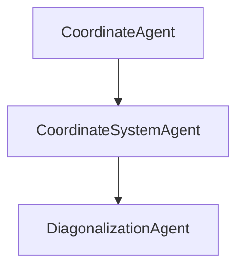

# **AGENTS.md**

## **Purpose**

Defines all conceptual and functional agents in the **Codex** framework — autonomous entities that collectively realize the scalable, operator-aware PDE method.
Each agent encapsulates a distinct role (geometry, physics, algebra, or integration) and interacts through symbolic or functional interfaces.

---

## **I. CONCEPTUAL OVERVIEW**

### 1. Mirrors of Functionality

Think of the framework as a **hall of mirrors** centered on the abstract contract `CoordinateSystem`:

| Mirror                     | Layer               | Core Purpose                                                      |
| -------------------------- | ------------------- | ----------------------------------------------------------------- |
| **Numeric**                | `core`              | Evaluate, decompose, reconstruct numerically.                     |
| **Symbolic**               | `pspace.symbolic`   | Maintain symbolic equivalence (SymPy, recurrences, closed forms). |
| **Analytic**               | `pspace.analytic`   | Evaluate inner products in closed form (Legendre/Hermite/Laguerre) |
| **Optimization / Control** | `pspace.optimize`   | Expose gradients, adjoints, sensitivities.                        |
| **Data / I/O**             | `pspace.export`     | Serialize operations and metadata for reproducibility.            |
| **Diagnostics / Logging**  | `pspace.diagnostic` | Monitor conditioning, residuals, cache hits, memory.              |
| **Surrogate / ML**         | `pspace.learn`      | Replace exact evaluation with trained surrogates (GP/Nets).       |

Symbolic mirrors live in `pspace/symbolic.py`, while closed-form analytic evaluation sits in `pspace/analytic.py`, each preserving the `CoordinateSystem` contract for their domain.

The pattern — stable core dipped in layered, interchangeable contexts — is best captured by the **Decorator pattern**, extended philosophically toward **Aspect-Oriented Programming (AOP)**.

| Layer                            | Concept                                     | Essence                                                                                            |
| -------------------------------- | ------------------------------------------- | -------------------------------------------------------------------------------------------------- |
| **Structural**                   | **Decorator pattern**                       | Dynamically wraps an object to add responsibilities without altering its interface.                |
| **Behavioral / Cross-cutting**   | **Aspect-Oriented Programming (AOP)**       | Injects context-specific behavior (profiling, logging, validation) orthogonally to the core logic. |
| **Functional abstraction**       | **Context or Policy pattern**               | Selects variant behavior by changing attached “sauces” rather than subclassing.                    |
| **Philosophical generalization** | **Reflective / Meta-object protocol (MOP)** | The system can observe and modify its own structure and semantics.                                 |

So:

> “Dipping the stick in multiple sauces” = *Decorators composed through AOP semantics, implemented via a meta-object protocol.*

Down the line we can layer context selectors that pick the right combo for a workload—e.g., sparse analytic for fast verification, dense numeric for debugging, dense symbolic for derivations.

If each “aspect” is a basis vector in the abstract space of behaviors, the concrete coordinate system is just a linear combination (composition)
  of those vectors. Parallelism naturally fits as another basis element: a parallel aspect can wrap the same contract, orchestrate thread/MPI/GPU execution, and remain orthogonal to geometry, algebra, or
  sparsity concerns.

  Key considerations:

  - Composition discipline: we’ll want a well-defined order or policy when layering multiple aspects (e.g., parallel + sparsity + profiling) so their interactions stay predictable.
  - Context selection: eventually a “context composer” can assemble the chosen basis vectors based on the use case (e.g., analytic+parallel for verification, symbolic+sparsity for codegen checks).
  - Data contracts: shared state (coordinates, basis maps, caches) has to remain consistent across aspects; adopting thin trait wrappers over a common mutable core helps.

  Overall, treating aspects as basis vectors gives us a neat algebra for configuring the system. Parallelism slips right in: it’s another vector we can mix, provided we standardize the interfaces and keep
  combinations associative/commutative where possible.

### 2. High-Dimensional Dualities

Beyond “basis vs coefficients,” the system mirrors several dual spaces:

* Primal ↔ Adjoint
* Physical ↔ Computational ↔ Probabilistic coordinates (y, z, ξ)
* Tensor ↔ Sparse ↔ Low-rank representations
* Operator ↔ Data duals (Gram vs samples)
* Time ↔ Frequency domains (FFT-based periodic coordinates)

Each interface has a dual that traverses an alternative representation seamlessly.
Keeping the abstract contract consistent allows new mirrors without breaking geometric symmetry.

---

## **II. AGENT REGISTRY (Machine-Readable)**

```yaml
#=====================================================================#
#  AGENTS.yaml — Unified Registry
#=====================================================================#

version: 1.0
project: Probabilistic-Spatio-Temporal PDE Framework
description: >
  Functional agents implementing geometry–physics–algebra separation,
  operator-aware decomposition, lifting, and diagonalization.

#------------------------------------------------------#
geometry:
  Coordinate: {description: "Base interface for axis definition, mappings, and weights.", implementation: core.py::Coordinate}
  NormalCoordinate: {description: "Gaussian axis; basis = Hermite.", implementation: core.py::NormalCoordinate}
  UniformCoordinate: {description: "Uniform domain; basis = Legendre.", implementation: core.py::UniformCoordinate}
  ExponentialCoordinate: {description: "Exponential domain; basis = Laguerre.", implementation: core.py::ExponentialCoordinate}
  CoordinateFactory: {description: "Factory assigning coordinate IDs.", implementation: core.py::CoordinateFactory}
  CoordinateSystem: {description: "Manages coordinates, basis, quadrature, decomposition.", implementation: core.py::CoordinateSystem}

basis:
  BasisFunctionType: {description: "Enum of basis construction types.", implementation: core.py::BasisFunctionType}
  PolyFunction: {description: "Polynomial function container f(Y)=Σ cα Y^α.", implementation: core.py::PolyFunction}
  generate_basis_tensor_degree: {description: "Tensor-product polynomial basis.", implementation: stochastic_utils.py}
  generate_basis_total_degree: {description: "Total-degree polynomial basis.", implementation: stochastic_utils.py}
  generate_basis_adaptive: {description: "Adaptive function-dependent basis.", implementation: stochastic_utils.py}
  sum_degrees: {description: "Per-axis degree addition.", implementation: stochastic_utils.py}
  sum_degrees_union_vector: {description: "Quadrature degree for f · ψ_k.", implementation: stochastic_utils.py}
  sum_degrees_union_matrix: {description: "Quadrature degree for f · ψ_i · ψ_j.", implementation: stochastic_utils.py}

quadrature:
  minnum_quadrature_points: {description: "Minimum Gauss points for degree-d integration.", implementation: stochastic_utils.py}
  build_quadrature: {description: "Tensor-product quadrature generator.", implementation: core.py::CoordinateSystem.build_quadrature}
  inner_product: {description: "Compute ⟨f,g⟩ by Gauss quadrature.", implementation: core.py}
  inner_product_basis: {description: "Compute ⟨ψ_i, f, ψ_j⟩ triple products.", implementation: core.py}

symbolic:
  SymbolicCoordinateSystem: {description: "Mirror of CoordinateSystem using SymPy backends.", implementation: symbolic.py::CoordinateSystem}
  SymbolicVectorInnerProductOperator: {description: "Symbolic evaluator for ⟨f,ψ_k⟩.", implementation: symbolic.py::SymbolicVectorInnerProductOperator}
  SymbolicMatrixInnerProductOperator: {description: "Symbolic evaluator for ⟨ψ_i,f,ψ_j⟩.", implementation: symbolic.py::SymbolicMatrixInnerProductOperator}

analytic:
  AnalyticCoordinateSystem: {description: "Closed-form mirror of CoordinateSystem.", implementation: analytic.py::CoordinateSystem}
  AnalyticVectorInnerProductOperator: {description: "Closed-form evaluator for ⟨f,ψ_k⟩.", implementation: analytic.py::AnalyticVectorInnerProductOperator}
  AnalyticMatrixInnerProductOperator: {description: "Closed-form evaluator for ⟨ψ_i,f,ψ_j⟩.", implementation: analytic.py::AnalyticMatrixInnerProductOperator}

operators:
  RFMD: {description: "Rigid–Flexible Mode Decomposition separating nullspace and rangespace.", implementation: conceptual}
  LiftingOperator: {description: "Constructs U_lift to impose BCs; isolates homogeneous w(x).", implementation: conceptual}
  IOC: {description: "Integration-of-Coefficients algebraizes derivatives into degree shifts.", implementation: conceptual + core.py}
  OperatorDiagonalization: {description: "Select orthogonal basis → diagonal stiffness ⟨ψ_i,Lψ_j⟩=λ_iδ_ij.", implementation: orthogonal_polynomials.py}
  PreconditionedPhysics: {description: "Uses operator inverse as preconditioner.", implementation: conceptual}
  AugmentedDiagonalization: {description: "Maintains diagonal form for saddle systems.", implementation: conceptual}

orthogonal_polynomials:
  unit_hermite: {description: "Orthonormal Hermite ψ_d(z).", implementation: orthogonal_polynomials.py}
  unit_legendre: {description: "Orthonormal shifted Legendre ψ_d(z).", implementation: orthogonal_polynomials.py}
  unit_laguerre: {description: "Orthonormal Laguerre ψ_d(z).", implementation: orthogonal_polynomials.py}
  shifted_legendre_quadrature: {description: "Gauss–Legendre quadrature on [0,1].", implementation: orthogonal_polynomials.py}
  tensor_indices: {description: "Generate tensor index mappings.", implementation: orthogonal_polynomials.py}

decomposition:
  decompose: {description: "Compute coefficients c_k = ⟨f,ψ_k⟩.", implementation: core.py}
  decompose_matrix: {description: "Assemble A_ij = ⟨ψ_i,f,ψ_j⟩.", implementation: core.py}
  check_orthonormality: {description: "Verify ⟨ψ_i,ψ_j⟩ = δ_ij.", implementation: core.py}
  check_decomposition_numerical_symbolic: {description: "Compare numeric vs analytic decomposition.", implementation: core.py}
  check_decomposition_matrix_sparse_full: {description: "Validate sparse vs full assembly.", implementation: core.py}
  check_decomposition_matrix_numerical_symbolic: {description: "Compare numeric vs analytic matrices.", implementation: core.py}

example_diagonalization:
  problem: "U'' = −½ x + ⅓,  U(−1)=¼, U(1)=⅕ on [−1,1]"
  stages:
    - lift: "U_lift(x)=α+βx from rigid modes {1,x}"
    - flexible_basis: "ψ_k(x) = (1−x²)P_{k−2}(x) or ∫_{−1}^x P_k(s)ds"
    - stiffness_matrix: "A_jk = ⟨ψ_j',ψ_k'⟩ = 2/(2k+1) δ_jk"
    - IOC_monomial: "Sparse parity-blocked band matrix"
    - operator_diagonalization: "Rotate to orthogonal basis → diagonal λ_k a_k = b_k"
  eigenvalues:
    integrated_legendre: "λ_k = 2/(2k+1)"
    sine_basis: "λ_n = (nπ/2)²"

workflow:
  - geometry: "CoordinateFactory → CoordinateSystem"
  - basis: "generate_basis_*"
  - quadrature: "build_quadrature, inner_product"
  - operator: "IOC, OperatorDiagonalization"
  - verification: "check_* routines"

philosophy:
  - "Geometry defines measure."
  - "Physics defines operator."
  - "Algebra defines computation."
  - "Diagonalization reveals hidden simplicity."


agents:
  - name: core.interface
    role: canonical_contract
    description: >
      The base abstract interface defining the invariant operations.
      All reflections wrap or extend this contract without mutation.

  - name: mirror.profiling
    type: decorator
    category: performance
    role: measures
    description: >
      Profiles runtime behavior and performance metrics of the wrapped interface.
      Reports timing, memory, and call-frequency statistics.

  - name: mirror.validation
    type: aspect
    category: correctness
    role: validates
    description: >
      Cross-checks results against analytic references or tolerance thresholds.

  - name: mirror.verification
    type: aspect
    category: numerical
    role: verifies
    description: >
      Ensures the discrete implementation satisfies the governing equations
      within prescribed numerical residual bounds.

  - name: mirror.symbolic
    type: decorator
    category: algebraic
    role: reflects
    description: >
      Mirrors the algebraic operations into symbolic form for inspection or
      code generation. Enables closed-form manipulation and differentiation.

  - name: mirror.sparsity
    type: decorator
    category: algebraic
    role: optimizes
    description: >
      Injects sparsity awareness into linear algebra kernels and data structures.
      Keeps dense and sparse representations consistent.

  - name: mirror.parallel
    type: decorator
    category: orchestration
    role: distributes
    description: >
      Wraps the same interface to orchestrate multi-threaded, MPI, or GPU
      execution. Remains orthogonal to algebraic and geometric aspects.

  - name: mirror.debug
    type: aspect
    category: inspection
    role: traces
    description: >
      Intercepts all method calls, capturing arguments and results for traceability.

  - name: context.composer
    type: orchestrator
    category: meta
    role: composes
    description: >
      Assembles chosen aspects as a linear combination (basis composition)
      to form the reflected implementation for a given workload.
      Maintains composition policy (order, associativity, commutativity).

composition_policy:
  order: [parallel, sparsity, profiling, symbolic, validation, verification, debug]
  associative: true
  commutative: partial
  shared_state: core.interface

notes:
  - Treat each mirror as a basis vector in behavior space.
  - Composition defines the coordinates of a concrete reflected implementation.
  - Parallelism is an independent orthogonal axis that can wrap any contract.
  - Ensure all decorators expose identical signatures for composability.
```

---

## **III. CONTRIBUTOR FORMATTING GUIDELINES**

### 1. Header Style

* Use `##` for sections (*Overview*, *Registry*, *Guidelines*).
* Use `###` for subtopics.
* Agent names in bold `**PascalCase**`.

### 2. YAML Block Rules

* Each agent block begins with `- name:` followed by keys in this order:
  `file`, `implements`, `role`, `responsibilities`, `dependencies`, `outputs`, `philosophy`.
* For conceptual (non-code) agents include `virtual: true`.
* Indentation: **two spaces per level**.
* Philosophy text folded using `>` for readability.

### 3. Naming & Cross-References

* Agent names follow **PascalCase** ending with `Agent`.
* Roles: concise (≤ 5 words).
* Dependencies list only other agent names.
* Use `file::Class` or `file::function` under `implements`.

### 4. Philosophy Text

* ≤ 3 lines, summarizing how the agent fits geometry–physics–algebra triad.

### 5. Visual Conventions

When embedding diagrams:



Use **Tableau colors** — blue (geometry), orange (physics), green (algebra), purple (interface).

### 6. Commit Protocol

* Add code → add registry entry → check dependency consistency.
* Regenerate documentation (`docs/agents.html`) after merge.

### 7. Core Aesthetic

* Bold and thick visuals, equal line weights, mild colors.
* Preserve the philosophy:
  **“All mathematics is the art of diagonalization.”**

---
